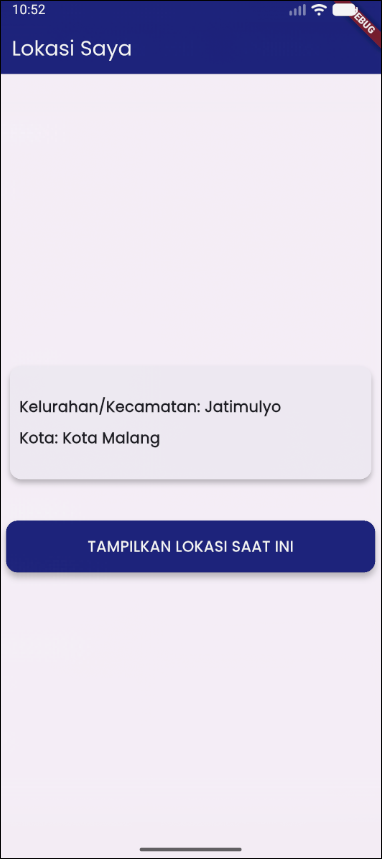

# 📱 Mobile Programming – Modul 12
**Akses Lokasi dengan GPS di Flutter**

## 👤 Identitas
- **Nama**: Ahmad Nashir Ulwan
- **NIM**: 230605110122
- **Kelas**: B

---

## 🎯 Tujuan
- Memahami konsep pengambilan data lokasi (GPS) perangkat menggunakan Flutter.
- Menerapkan paket `geolocator` untuk mengakses koordinat (latitude & longitude) secara *real-time*.
- Menerapkan paket `geocoding` untuk mengubah data koordinat menjadi alamat (reverse geocoding).
- Menangani proses permintaan izin (permission) lokasi pada platform Android.
- Membuat antarmuka yang responsif untuk menampilkan data lokasi menggunakan `StatefulWidget` dan `setState()`.

---

## 📝 Ringkasan Tugas
Karena pada modul ini tidak ada tugas spesifik dan hanya berisi praktikum, maka ringkasan ini menjelaskan alur kerja dari praktikum yang telah dilakukan:

1.  **Setup Proyek & Dependensi**: Membuat proyek baru dan menambahkan paket `geolocator` serta `geocoding` ke dalam file `pubspec.yaml`.
2.  **Konfigurasi Izin Android**: Memodifikasi file `AndroidManifest.xml` untuk menambahkan izin `ACCESS_FINE_LOCATION` dan `ACCESS_COARSE_LOCATION` agar aplikasi dapat mengakses GPS.
3.  **Membuat UI (StatefulWidget)**: Membuat `HomePage` sebagai `StatefulWidget` untuk mengelola *state* seperti `_locationMessage` (koordinat), `_addressMessage` (alamat), dan `_isLoading` (status loading).
4.  **Logika Izin & Lokasi**: Membuat fungsi `determinePosition()` yang bertugas:
    -   Mengecek apakah layanan lokasi aktif.
    -   Mengecek status izin dan meminta izin (`Geolocator.requestPermission()`) jika belum diberikan.
    -   Menangani kasus jika izin ditolak.
    -   Mengambil lokasi saat ini (`Geolocator.getCurrentPosition()`) jika semua syarat terpenuhi.
5.  **Reverse Geocoding**: Membuat fungsi `getAddressFromLatLng()` untuk menerjemahkan objek `Position` (koordinat) menjadi alamat yang mudah dibaca menggunakan `geocoding.placemarkFromCoordinates()`.
6.  **Update State (setState)**: Memanggil `setState()` setelah semua proses *asynchronous* (pengambilan lokasi & alamat) selesai untuk memperbarui UI dengan data yang didapat atau pesan error.

---

## 📸 Screenshot Hasil
Berikut adalah tampilan aplikasi setelah berhasil mendapatkan lokasi dan alamat:

**Hasil Lokasi dan Alamat Berhasil Didapat**

---

## ✅ Kesimpulan
- Untuk mengakses GPS di Flutter, diperlukan paket eksternal seperti `geolocator` (untuk koordinat) dan `geocoding` (untuk alamat).
- Konfigurasi izin di level sistem operasi (seperti `AndroidManifest.xml` untuk Android) adalah langkah wajib agar paket dapat berfungsi.
- Penanganan izin *saat runtime* (mengecek, meminta, dan menangani penolakan) adalah bagian krusial dalam kode Dart untuk memastikan aplikasi berjalan di perangkat pengguna.
- Proses pengambilan lokasi bersifat *asynchronous* (`async/await`), sehingga `StatefulWidget` dengan `setState()` sangat efektif untuk mengelola *state loading* dan menampilkan data setelah proses selesai.
- *Reverse geocoding* (mengubah Lat/Long ke alamat) adalah proses *asynchronous* terpisah yang dipermudah oleh paket `geocoding`.